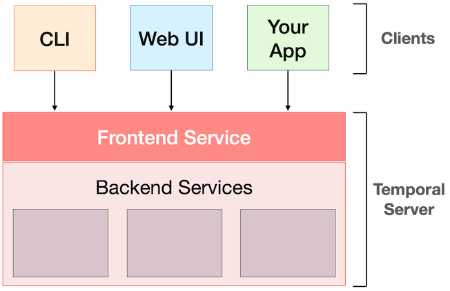
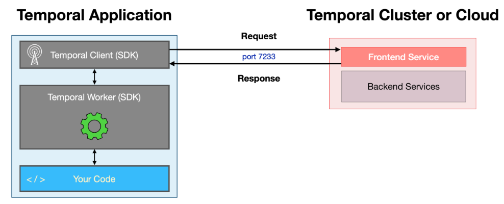
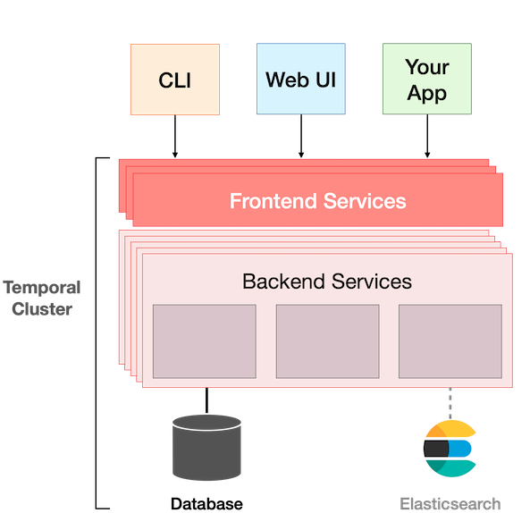
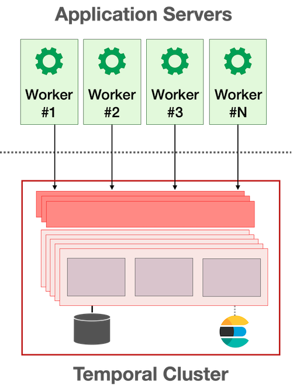
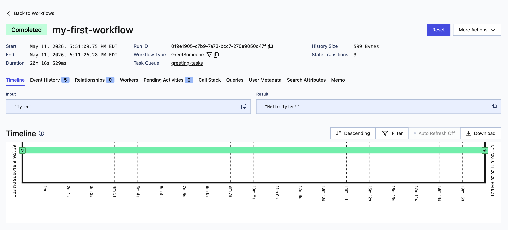

> The notes in the in this course are a combination of hand-written notes, and notes pasted directly from the course found at https://temporal.talentlms.com/plus/my/training/143
## Setting Up a Development Environment

Let's start by setting up an environment with the Temporal SDK:

1. `python3 -m venv env`
2. `source env/bin/activate`
3. `python -m pip install temporalio`

Now lets setup a local Temporal Service for development with the Temporal CLI.

1. `brew install temporal`
2. `echo "export PATH=\"$(dirname $(which temporal)):\$PATH\"" >> ~/.zshrc && source ~/.zshrc`

Let's run `temporal server start-dev` to start a local Temporal dev env.  This launches:
- the local Temporal Service
- a persistence layer/database
- the Temporal Web UI for observability and debugging

By default:
- the Temporal Service will be available at `localhost:7233`
- the Temporal Web UI will be available at `http://localhost:8233`

## What is Temporal?

In short, Temporal is a platform that guarantees the durable execution of your application code. It allows you to develop as if failures don't even exist. Your application will run reliably even if it encounters problems, such as network outages or server crashes, which would be catastrophic for a typical application. The Temporal platform handles these types of problems, allowing you to focus on the business logic, instead of writing application code to detect and recover from failures.

Temporal applications are built using an abstraction called **Workflows**. You'll develop those Workflows by writing code in a general-purpose programming language such as Go, Java, TypeScript, or Python. The code you write is the same code that will be executed at runtime, so you can use your favorite tools and libraries to develop Temporal Workflows.

Temporal Workflows are resilient. They can run and keeping running for years, even if the underlying infrastructure fails. If the application itself crashes, Temporal will automatically recreate its pre-failure state so it can continue right where it left off.

Conceptually, a workflow defines a sequence of steps. With Temporal, those steps are defined by writing code, known as a **Workflow Definition**, and are carried out by running that code, which results in a **Workflow Execution**.

#### Temporal Architecture

At its core, Temporal is not just an SDK, it's primarily a distributed backend service. Although Temporal includes a Web UI, the core system is not really a traditional web server. The Temporal Service itself is written in Go and communicates primarily over gRPC. The Temporal SDK and the Temporal CLI are clients that make RPC calls to the Temporal Service’s API, as would be a Temporal app you develop with the SDK.

Your Python workers and clients will connect to the Temporal Frontend Service (the Frontend Service acts as an API gateway) over gRPC & Protocol Buffers, while the Web UI lets us inspect workflow state, execution history, retries, task queues, and other runtime details in the browser.



Network communication to the frontend service can also optionally be secured with TLS to encrypt data in transit and validate certificates.



Like the CPU in a computer or the engine in a car, the Temporal Server is an essential part of the overall system, but requires additional components for operation. The complete system is known as the **Temporal Cluster**, which is a deployment of the Temporal Server software on some number of machines, plus the additional components used with it.

The only required component is a database, such as Apache Cassandra, PostgreSQL, or MySQL (SQLite by default for local dev). The Temporal Cluster tracks the current state of every execution of your Workflows. It also maintains a history of all Events that occur during their executions, which it uses to reconstruct the current state in case of failure. It persists this and other information, such as details related to durable timers and queues, to the database.

Elasticsearch is an optional component. It's not necessary for basic operation, but adding it will give you advanced searching, sorting, and filtering capabilities for information about current and recent Workflow Executions. This is helpful when you run Workflows millions of times and need to locate a specific one; for example, based on when it started, how long it took to run, or its final status. Two other tools are often used with Temporal. Prometheus is used to collect metrics from Temporal, while Grafana is used to create dashboards based on those metrics. Together, these tools help operations teams monitor cluster and application health.




One thing that people new to Temporal may find surprising is that *the Temporal Cluster does not execute your code*. While the platform guarantees the durable execution of your code, it achieves this through _orchestration_. The execution of your application code is external to the cluster, and in typical deployments, takes place on a separate set of servers, potentially running in a different data center than the Temporal Cluster.

The entity responsible for executing your code is known as a Worker, and it's common to run Workers on multiple servers, since this increases both the scalability and availability of your application. The Worker, which is part of your application, communicates with the Temporal Cluster to manage the execution of your Workflows.



The application will contain the code used to initialize the Worker, the Workflow, and other functions that comprise your business logic, and possibly also code used to start or check the status of the Workflow. At runtime, you'll need everything needed to execute the application, which will include any libraries or other dependencies referenced in your code, on each machine where at least one Worker process will run. Each machine running a Worker will require connectivity to the frontend service on the Temporal cluster.

#### Options for Running a Temporal Cluster

One option for deploying a self-hosted Temporal Cluster is to use Docker Compose, to run temporal as many containers on one machine. It's extremely convenient for development clusters because it avoids the need to manually install and configure individual components. Temporal maintains a [GitHub repository](https://github.com/temporalio/docker-compose) that offers several configurations for you to use.

Another option for self-hosting, which was described in the is the `temporal` command's built-in support for running a development server. This runs in a single process and doesn't have any external runtime dependencies, so it is less complex and less resource-intensive than using Docker Compose.

Self-hosted Temporal Clusters are often run on Kubernetes (to run temporal on many machines), although this is not required. The documentation provides [more information about cluster deployment](https://docs.temporal.io/cluster-deployment-guide).

The alternative to hosting your own Temporal Cluster is to use Temporal Cloud, a fully-managed cloud service operated and staffed by Temporal. It's a simple, secure, scalable way to power your Temporal applications, providing 99.9% uptime and SOC2 compliance. It also comes with developer and production support from the experts at Temporal.

Using Temporal Cloud frees your organization from the operational workload of running and supporting your own cluster, which involves not only the initial planning and deployment, but ongoing work to monitor, update, and scale it.

Temporal Cloud uses consumption-based pricing, so you only pay for what you use, and you can see your current and past usage at any time right from the web interface.

## Developing a Workflow

In Temporal, you define a Workflow in Python by creating a class. The code that makes up that class is known as the **Workflow Definition**.

`greeting.py`:
```python
class GreetSomeone:
    async def run(self, name: str) -> str:
        return f"Hello {name}!"
```

> The Temporal Python SDK uses the native `asyncio` functionality in the Python Standard Library, so we will define our method as an `async` method. Using non-async methods is supported, but require a more complex multi-process setup. For this reason we recommend using `async`. 

Let's now write a program to invoke this workflow:

`local_runner.py`:
```python
import sys
import asyncio
from workflow import GreetSomeone


async def main():
    name = sys.argv[1]
    greeter = GreetSomeone()
    greeting = await greeter.run(name)
    print(greeting)

if __name__ == "__main__":
    asyncio.run(main())
```

Now if we run `python local_runner.py Tyler` we get output `Hello Tyler!`.

On its own though, this is not yet a workflow definition, nothing from Temporal is at play here yet, so let's work towards that. 

Temporal doesn't impose any rules about how to name your Workflow method, so there's no need to rename the class we already wrote. Every Workflow has a name, which Temporal refers to as the **Workflow Type**. It's perhaps a confusing term because "type" can mean so many things, but you can think of it like a "type" in a programming language. In the Python SDK, by default, a Workflow's type is the name of the class used to define that Workflow, but it is possible to override it and provide a more user-friendly value since the Web UI displays Workflow Executions by their type.

Turning this method into a Temporal Workflow Definition requires just three steps:
- Import the `workflow` module from the Temporal Python SDK
- Decorate the class that will contain your Workflow Definition with the `@workflow.defn` decorator
- Decorate the method that defines your Workflow Definition with the `@workflow.run` decorator

`workflow.py`:
```python
from temporalio import workflow


@workflow.defn
class GreetSomeone:
    @workflow.run
    async def run(self, name: str) -> str:
        return f"Hello {name}!"
```


#### Input Parameters & Return Values

###### Values must be Serializable

In order for Temporal to store the Workflow's input and output, data used in input parameters and return values must be serializable. By default, Temporal can handle null or binary values, as well as any data that can be serialized into JSON. This means that most of the types you'd typically use in a function, such as integers and floating point numbers, boolean values, and strings, are all handled automatically, as are [`dataclasses`](https://docs.python.org/3/library/dataclasses.html) composed from these types, but types such as `datetime`, functions, or other non-serializable data types are prohibited as either input parameters or return values.

###### Data Confidentiality

Although the input parameters and return values are stored as part of the Event History of your Workflow Executions, you can create a custom Data Converter to encrypt the data as it enters the Temporal Cluster and decrypt it upon exit, thereby maintaining the confidentiality of any sensitive data used as input or output of your applications. Custom data converters are beyond the scope of the Temporal 101 course, but the [documentation provides more information](https://docs.temporal.io/concepts/what-is-a-data-converter/) and you can view [samples on GitHub](https://github.com/temporalio/samples-python/tree/main/encryption).

###### Avoid Passing Large Amounts of Data

Because the Event History contains the input and output, which is also sent across the network from the application to the Temporal Cluster, you'll have better performance if you limit the amount of data sent. For example, imagine you've created a Workflow that will convert audio files from one format to another. It would be much better to pass the path or URL for the files as input than to pass the _content_ of the files.

To protect against unexpected failures caused by sending or storing too much data, the Temporal Server imposes various limits beyond which it will emit warnings or errors, depending on the severity. The documentation includes a page that [details these limits](https://docs.temporal.io/kb/temporal-platform-limits-sheet).

#### Initializing the Worker

As mentioned earlier, Workers execute your Workflow code. The Worker itself is provided by the Temporal SDK, but your application will include code to configure and run it. When that code executes, the Worker establishes a persistent connection to the Temporal Cluster and begins polling a Task Queue on the Cluster, seeking work to perform. Since Workers execute your code, any Workflows you execute will make no progress unless one Worker is running.

In our current code, the `@workflow.defn` and `@workflow.run` annotations are effectively doing nothing because we never start the workflow through the Temporal client or run it inside a Temporal worker. That means no Temporal server, workflow history, replay, task queue, durability, or orchestration is involved, it is just regular Python execution with unused Temporal decorators attached. You can still initiate and persist a real workflow in Temporal without a worker running, but the workflow cannot make any progress until a worker connects to process tasks

There are typically three things you need in order to configure a Worker:
1. A Temporal Client: used to communicate with the Temporal Cluster
2. A Task Queue (more specifically, the name of a task queue): which is maintained by the Temporal Server and polled by the Worker
3. The Workflow Definition class: used to register the Workflow implementation with the Worker

`starter.py`:
```python
import asyncio

from temporalio.client import Client
from temporalio.worker import Worker

from greeting import GreetSomeone


async def main():
    client = await Client.connect("localhost:7233", namespace="default")
    # Run the worker
    worker = Worker(client, task_queue="greeting-tasks", workflows=[GreetSomeone])
    await worker.run()


if __name__ == "__main__":
    asyncio.run(main())
```

> The lifetime of the Worker and the duration of a Workflow Execution are unrelated. The `worker.run()` function used to start this Worker is a blocking function that doesn't stop unless it is shut down or encounters a fatal error. The Worker's process may last for days, weeks, or longer. If the Workflows it handles are relatively short, then a single Worker might execute thousands or even millions of them during its lifetime. On the other hand, a Workflow can run for years, while the server where a Worker process is running might be rebooted after a few months by an administrator doing maintenance. If the Workflow Type was registered with other workers, one or more of them will automatically continue where the original Worker left off. If there are no other Workers available, then the Workflow Execution will continue where it left off as soon as the original Worker is restarted. In either case, the downtime will not cause Workflow Execution to fail.

## Executing a Workflow

One way to start a Workflow is by using the `temporal` CLI. The `temporal workflow start` command specifies several arguments:
- Workflow Type: In the Python SDK, this defaults to the name of the class you specified as your Workflow definition with the `@workflow.defn` decorator.
- Task Queue Name: The task queue name the Temporal Cluster will use, which must exactly match the value supplied when initializing the Worker. Since task queues are dynamically created, typing the task queue name incorrectly would not cause an error, but it would result in two different task queues, and since the Cluster and Worker wouldn't share the same queue in this case, the Workflow Execution would never progress.
- Workflow ID: An optional, user-defined identifier, which typically has some business meaning. If omitted, a UUID will be automatically assigned as the Workflow ID.
- Input: Since this Workflow requires input, we should supply that value. When submitting a Workflow for execution through the command line, the input is always in JSON format, which is why the input in this command shows double quotes inside of single quotes. Typing JSON directly on the command line is fine for a simple case like this, where there's just one parameter and a single value, but it would be a clumsy way of passing more complex data. Luckily, you can save the input to a file, in JSON format, and specify its path to the `--input-file` option, rather than using the `--input` option to specify the data inline, as shown here.

```
temporal workflow start \
    --type GreetSomeone \
    --task-queue greeting-tasks \
    --workflow-id my-first-workflow \
    --input '"Tyler"'
```

When you run the command, it submits your execution request to the cluster, which responds with the Workflow ID, which will be the same as the one you provided, or assigned UUID if you omitted it. It also displays a Run ID, which uniquely identifies this _specific execution_ of the Workflow. However, it does not display the result returned by the Workflow, since Workflows might run for months or years. You can use the `temporal workflow show --workflow-id <WorkflowID>` command to retrieve the result.

In the `hellow-workflow` exercise with code:

`exercises/hello-workflow/solution/worker.py`:
```python
import asyncio

from temporalio.client import Client
from temporalio.worker import Worker

from greeting import GreetSomeone


async def main():
    client = await Client.connect("localhost:7233", namespace="default")
    # Run the worker
    worker = Worker(
        client,
        task_queue="greeting-tasks",
        workflows=[GreetSomeone],
    )
    print("Starting worker...")
    await worker.run()


if __name__ == "__main__":
    asyncio.run(main())
```

`exercises/hello-workflow/solution/greeting.py`:
```python
from temporalio import workflow


@workflow.defn
class GreetSomeone:
    @workflow.run
    async def run(self, name: str) -> str:
        return f"Hello {name}!"
```

In `exercises/hello-workflow/practice`, we can run the worker with `python worker.py`, then run the workflow with `temporal workflow start` with parameters above. Now if we do  `temporal workflow show -w my-first-workflow` we get output:

```sh
Progress:
  ID           Time                     Type           
    1  2026-05-11T22:11:58Z  WorkflowExecutionStarted  
    2  2026-05-11T22:11:58Z  WorkflowTaskScheduled     
    3  2026-05-11T22:11:58Z  WorkflowTaskStarted       
    4  2026-05-11T22:11:58Z  WorkflowTaskCompleted     
    5  2026-05-11T22:11:58Z  WorkflowExecutionCompleted

Results:
  Status          COMPLETED
  Result          "Hello Tyler!"
  ResultEncoding  json/plain
```

Instead of the CLI, we could have also started the workflow programtically:

`programatically_start_workflow.py`:
```python
import asyncio
import sys

from greeting import GreetSomeone
from temporalio.client import Client


async def main():
    # Create client connected to server at the given address
    client = await Client.connect("localhost:7233")

    # Execute a workflow
    handle = await client.start_workflow(
        GreetSomeone.run,
        sys.argv[1],
        id="greeting-workflow",
        task_queue="greeting-tasks",
    )

    print(f"Started workflow. Workflow ID: {handle.id}, RunID {handle.result_run_id}")

    result = await handle.result()

    print(f"Result: {result}")


if __name__ == "__main__":
    asyncio.run(main())
```

## Viewing Workflow Execution History

We showed earlier that we could do `temporal workflow show --workflow-id my-first-workflow`. We can also add a `--detailed` flag to the end of that for a more verbose and detailed result:

```sh
--------------- [1] WorkflowExecutionStarted ---------------
attempt: 1
eventTime: 2026-05-11T22:11:58.935390Z
firstExecutionRunId: 019e1918-d757-75ef-ac3a-8b4fa9642b1a
firstWorkflowTaskBackoff: 0s
identity: temporal-cli:liquort@ADSKP6P2GVHL7H
input[0]: Tyler
originalExecutionRunId: 019e1918-d757-75ef-ac3a-8b4fa9642b1a
taskId: 1048624
taskQueue.kind: TASK_QUEUE_KIND_NORMAL
taskQueue.name: greeting-tasks
workflowExecutionTimeout: 0s
workflowId: test-workflow-2
workflowRunTimeout: 0s
workflowTaskTimeout: 10s
workflowType.name: GreetSomeone

--------------- [2] WorkflowTaskScheduled ---------------
attempt: 1
eventTime: 2026-05-11T22:11:58.935460Z
startToCloseTimeout: 10s
taskId: 1048625
taskQueue.kind: TASK_QUEUE_KIND_NORMAL
taskQueue.name: greeting-tasks

--------------- [3] WorkflowTaskStarted ---------------
eventTime: 2026-05-11T22:11:58.937710Z
historySizeBytes: 302
identity: 31226@ADSKP6P2GVHL7H
requestId: 3e8ea4da-dd3d-4256-80e5-2e0119f5e388
scheduledEventId: 2
taskId: 1048630
workerVersion.buildId: 967b46b914ad2aa32e44861d5347d2cc

--------------- [4] WorkflowTaskCompleted ---------------
eventTime: 2026-05-11T22:11:58.942618Z
identity: 31226@ADSKP6P2GVHL7H
scheduledEventId: 2
sdkMetadata.coreUsedFlags[0]: 1
sdkMetadata.coreUsedFlags[1]: 2
startedEventId: 3
taskId: 1048634
workerVersion.buildId: 967b46b914ad2aa32e44861d5347d2cc

--------------- [5] WorkflowExecutionCompleted ---------------
eventTime: 2026-05-11T22:11:58.942649Z
result[0]: Hello Tyler!
taskId: 1048635
workflowTaskCompletedEventId: 4

Results:
  Status          COMPLETED
  Result          "Hello Tyler!"
  ResultEncoding  json/plain
```

This becomes unwieldy when you have lots of workflows. Its much easier to view workflow execution through the Web UI.

The method you use to access it for your own Temporal instance will vary based on the type of deployment. For example, if you're using Temporal Cloud, you'll access it through a secured connection to the standard HTTPS port on `cloud.temporal.io`, which will require you to log in.

If you used `temporal` to deploy a development cluster to your laptop, you can access it through localhost on port 8233, (or whatever port you configured the Temporal UI to run on). If you're using a self-hosted production cluster, ask your administrator for the hostname and port number.



> Note: the Web UI shows a table of Workflow Executions within a given **namespace**. A namespace provides a means of isolation within Temporal, much like how namespaces or packages in some programming languages provide isolation between different parts of the code. They allow you to logically separate things, using whatever criteria meets your needs. For example, you might isolate Workflows based on their status by having a "development" namespace and a "production" namespace. Or you might separate them by team or department, in which case you might have one namespace for Marketing and another for Accounting. One aspect of this isolation is that some configuration options or concepts are applied on a per-namespace level, rather than the entire cluster. For example, Temporal guarantees that there is only one Workflow Execution with a given Workflow ID currently running within any given namespace. The default namespace is named `default`, and you can use `temporal` to register additional namespaces and your code will specify the namespace it wants to use using a configuration option provided when creating a client.

## Modifying An Existing Workflow

Backwards compatibility is an important consideration in Temporal. You might execute a given Workflow Definition hundreds, thousands, or millions of times. If the execution fails, the Temporal will reconstruct the Workflow's state before the failure, and then continue on with the execution. It's premature to cover the details of how that works, but it has some implications on how you develop and maintain the Workflow Definitions.

#### Input Parameters and Return Values

In general, you should avoid changing the number or types of input parameters and return values for your Workflow.

Temporal recommends that your Workflow Function takes a single input parameter, a `dataclass`, rather than multiple input parameters. Adding optional fields to the dataclass doesn't change the type of the dataclass itself, so this provides a backwards-compatible way to evolve your code. Note that the examples used in this course don't follow this advice, which was a deliberate choice meant to reduce complexity and make it easier for Python beginners to follow along. However, you'll see this pattern in the Temporal tutorials written in Python.

#### Determinism

Although Temporal applications are frequently used to manage [non-deterministic](https://docs.temporal.io/workflow-definition#deterministic-constraints) work, such as calls to microservices or LLMs, the Workflow Definition itself is the deterministic code used to orchestrate that work. Temporal has a specific definition of determinism, but understanding it requires more detailed knowledge of Workflow Execution, so we can generalize for now. You can view determinism as a requirement that the Workflow’s orchestration logic must make the same decisions, given the same execution history. This means that you generally should not directly perform non-deterministic operations such as generating random numbers, reading the current time, or making network requests inside Workflow code itself, though these types of operations are commonly performed inside Activities and their code (we'll see this later).

#### Versioning

Since Workflow Executions in Temporal can run for long periods, it's common to need major changes to a Workflow Definition, even while a particular Workflow Execution is in progress. For example, imagine that your Workflow currently notifies a customer when an order is shipped with an e-mail notification. Later, you decide to change the Workflow so that it sends both an email and a text message instead. Versioning is a feature in Temporal that helps manage these code changes safely. With Versioning, you can modify your Workflow Definition so that new executions use the updated code, while existing ones continue running the original version. This is particularly useful when you make a Workflow code change that would otherwise break replay compatibility for already-running Workflow Executions, such as changing the order of execution or adding/removing Workflow steps. These are considered non-deterministic changes because replaying existing Workflow history against the modified Workflow Definition would cause the Workflow to make different decisions than it originally did. You can use the SDK’s ["Versioning"](https://docs.temporal.io/develop/python/versioning) feature to identify when a non-deterministic change is introduced.

#### Restarting the Worker Process

After making changes to your application, you'll need to deploy them to the server.

With most Temporal SDKs, you must restart the Worker for your code changes to take effect. While the Python SDK uses a sandbox which automatically reloads the Workflow from disk each execution, making this restart unnecessary, this is an implementation detail specific to the Temporal Python SDK and may change in the future. Therefore, to ensure proper execution, we recommend stopping your worker and restarting it every time you make a change to your code.

## Developing an Activity

In Temporal, you can use **Activities** to encapsulate business logic that is prone to failure. Unlike the Workflow Definition, there is no requirement for an Activity Definition to be deterministic. In general, any operation that introduces the possibility of failure should be done as part of an Activity, rather than as part of the Workflow directly. While Activities are executed as part of Workflow Execution, they have an important characteristic: they're retried if they fail. If you have an extensive Workflow that needs to access a service, and that service happens to become unavailable, you don't want to re-run the entire Workflow. Instead, you just want to retry the part that failed, so you can define that code in an Activity and reference it in your Workflow Definition. The code within that Activity Definition will be executed, retried if necessary, and the Workflow will continue its progress once the Activity completes successfully.

An Activity Definition in Python can be implemented multiple ways. One way is to implement the Activity as a function decorated with the `@activity.defn` decorator.

```python
from temporalio import activity

@activity.defn
async def greet_in_french(name: str) -> str:
    return f"Bonjour {name}!"
```

Activities in Python can be implemented either as functions or as methods within a class that groups activities, depending on your needs. For example, if you need to pass a client session for performing HTTP requests:

```python
class TranslateActivities:
    def __init__(self, session: aiohttp.ClientSession):
        self.session = session

    @activity.defn
    async def greet_in_spanish(self, name: str, stem: str) -> str:
        base = f"http://localhost:9999/{stem}"
        url = f"{base}?name={urllib.parse.quote(name)}"

        async with self.session.get(url) as response:
            translation = await response.text()

        return translation
```

Activities have the same rules about types allowed as input parameters and return values as the Workflow Definition. For example, anything that converts to JSON is fine, but things like `datetime`, functions, or other non-serializable data types are not. Temporal doesn't impose rules about how an activity function/method is named. Temporal recommends you keep your Workflow Definitions in a separate file from the rest of your code. Due to the Temporal Python SDK implementation the Workflow Definition file is reloaded on every execution. Minimizing the contents of that file will minimize reloads and improve performance.

#### Asynchronous vs. Synchronous Activity Implementations

The Temporal Python SDK supports multiple ways of implementing an Activity:

- Asynchronously using [`asyncio`](https://docs.python.org/3/library/asyncio.html)
- Synchronously multithreaded using [`concurrent.futures.ThreadPoolExecutor`](https://docs.python.org/3/library/concurrent.futures.html#threadpoolexecutor)
- Synchronously multiprocess using [`concurrent.futures.ProcessPoolExecutor`](https://docs.python.org/3/library/concurrent.futures.html#processpoolexecutor) and [`multiprocessing.managers.SyncManager`](https://docs.python.org/3/library/multiprocessing.html#multiprocessing.managers.SyncManager)

> By “synchronous multithreading/multiprocessing”, we mean that the Activity functions themselves are typically implemented as normal blocking Python functions rather than `async def` coroutines using `asyncio`. In these models, concurrency comes from multiple threads or processes rather than from an asynchronous event loop, and incorrectly mixing the two concurrency models can lead to sporadic and unexpected runtime issues.

> Recall that the Global Interpreter Lock (GIL) allows only one thread to execute Python bytecode at a time within a single process. Because of this, multithreading is often best suited for I/O-bound work, such as network or file operations, because threads can release the GIL while waiting on blocking I/O, allowing other threads to make progress. It is less useful for CPU-bound computation, where threads mostly compete for the same GIL. Multiprocessing avoids this limitation because each process has its own Python interpreter and GIL, allowing CPU-bound work to execute truly in parallel across multiple CPU cores.

It is important to implement your Activities using the correct method, otherwise your application may fail in sporadic and unexpected ways. Which one you should use depends on your use case. This section provides guidance to help you choose the best approach.

Careful! Blocking the async event loop in Python would turn your asynchronous program into a synchronous program that executes serially, defeating the entire purpose of using `asyncio`. This can also lead to potential deadlock, and unpredictable behavior that causes tasks to be unable to execute. Debugging these issues can be difficult and time consuming, as locating the source of the blocking call might not always be immediately obvious. Due to this, Python developers must be extra careful to not make blocking calls from within an asynchronous Activity, or use an async safe library to perform these actions. For example, making an HTTP call with the popular `requests` library within an asynchronous Activity would lead to blocking your event loop. If you want to make an HTTP call from within an asynchronous Activity, you should use an async-safe HTTP library such as `aiohttp` or `httpx`. Otherwise, use a synchronous Activity.

Here's an example of an asynchronous activity:
```python
import aiohttp
import urllib.parse
from temporalio import activity


class TranslateActivities:
    def __init__(self, session: aiohttp.ClientSession):
        self.session = session

    @activity.defn
    async def greet_in_spanish(self, name: str) -> str:
        greeting = await self.call_service("get-spanish-greeting", name)
        return greeting

    # Utility method for making calls to the microservices
    async def call_service(self, stem: str, name: str) -> str:
        base = f"http://localhost:9999/{stem}"
        url = f"{base}?name={urllib.parse.quote(name)}"

        async with self.session.get(url) as response:
            translation = await response.text()

            if response.status >= 400:
                raise ApplicationError(
                    f"HTTP Error {response.status}: {translation}",
                    # We want to have Temporal automatically retry 5xx but not 4xx
                    non_retryable=response.status < 500,
                )

            return translation
```

> The `aiohttp` library requires an established `Session` to perform the HTTP request. It would be inefficient to establish a `Session` every time an Activity is invoked, so instead this code accepts a `Session` object as an instance parameter and makes it available to the methods. This approach will also be beneficial when the execution is over and the `Session` needs to be closed.

Here's an example of a synchronous activity using the blocking `requests` library:

```python
import urllib.parse
import requests
from temporalio import activity


class TranslateActivities:

    @activity.defn
    def greet_in_spanish(self, name: str) -> str:
        greeting = self.call_service("get-spanish-greeting", name)
        return greeting

    # Utility method for making calls to the microservices
    def call_service(self, stem: str, name: str) -> str:
        base = f"http://localhost:9999/{stem}"
        url = f"{base}?name={urllib.parse.quote(name)}"

        response = requests.get(url)
        return response.text
```

In the above example, we chose not to share a `requests.Session` across Activity executions, so `__init__` was removed. While `requests` does support creating sessions, a shared `requests.Session` contains mutable state and does not provide a simple, explicit thread-safety guarantee for all usage. This matters for synchronous threaded Activities because, as noted earlier, multiple threads can have I/O-bound work in flight at the same time and may interleave access to shared objects. Due to no longer having or needing `__init__`, the case could be made here to not implement the Activities as a class, but just as decorated functions:

```python
@activity.defn
def greet_in_spanish(name: str) -> str:
    greeting = call_service("get-spanish-greeting", name)
    return greeting

# Utility method for making calls to the microservices
def call_service(stem: str, name: str) -> str:
    base = f"http://localhost:9999/{stem}"
    url = f"{base}?name={urllib.parse.quote(name)}"

    response = requests.get(url)
    return response.text
```

Asynchronous Activities have many advantages, such as potential speed up of execution. However, as discussed above, making unsafe calls within the async event loop can cause sporadic and difficult to diagnose bugs. For this reason, we recommend using asynchronous Activities _only_ when you are certain that your Activities are async safe and don't make blocking calls. If you experience bugs that you think may be a result of an unsafe call being made in an asynchronous Activity, convert it to a synchronous Activity and see if the  
issue resolves.

#### Registering Activities

You may recall that you must register your Workflows when initializing the Worker. You must also perform a similar step for Activities. The process for registering the Activity is almost identical to that for registering a Workflow.

If you are registering an Activity implemented as a function, you will import the function from the source file and pass it via a keyword argument, similarly to how you register a workflow.

```python
from temporalio.client import Client
from temporalio.worker import Worker

from translate import greet_in_spanish
from greeting import GreetSomeone

# Code not pertaining to the registration has been omitted
...
    worker = Worker(
        client,
        task_queue="greeting-tasks",
        workflows=[GreetSomeone],
        activities=[greet_in_spanish],
    )
...
```

Here's an example of registering an async activity:

```python
import asyncio
import aiohttp

from temporalio.client import Client
from temporalio.worker import Worker

from translate import TranslateActivities
from greeting import GreetSomeone


async def main():
    client = await Client.connect("localhost:7233", namespace="default")
    
    # Run the worker
    async with aiohttp.ClientSession() as session:
        activities = TranslateActivities(session)

        worker = Worker(
            client,
            task_queue="greeting-tasks",
            workflows=[GreetSomeone],
            activities=[activities.greet_in_spanish],
        )
        await worker.run()


if __name__ == "__main__":
    asyncio.run(main())
```

###### Modifying the Worker to Execute Synchronous Activities Concurrently

When executing Synchronous Activities, you must pass an `activity_executor` to the Worker. Currently the Temporal Python SDK supports Thread Pools or Multiprocessing as your Activity Executor. Which one to use is dependent on your use case and deployment. This example will show how to use a `ThreadPoolExecutor` as your Activity Executor.

When using the `ThreadPoolExecutor`, first import `concurrent.futures`. Next, create a `ThreadPoolExecutor` object and specify the maximum number of workers. This number is dependent on the number of `max_concurrent_activities` set by the Worker. Currently, the Worker sets the number of `max_concurrent_activities` to `100` by default. Therefore you should set out `max_workers` option in the `ThreadPoolExecutor` to at least `100`. If you were to set `max_workers` to a value less than the Worker's `max_concurrent_activities` it would be possible for the worker to accept tasks but be unable to process them due to the thread pool being too busy. This could potentially lead to timeouts, so be conscious when setting this value.

If you use a Context Manager for the creation of your `ThreadPoolExecutor` (as we'll show below), be sure to assign the object to a variable using the `as` statement. Finally, pass in your `ThreadPoolExecutor` to the Worker using the `activity_executor` keyword argument.

Here's the finished example:
```python
import concurrent.futures
import asyncio

from temporalio.client import Client
from temporalio.worker import Worker

from translate import TranslateActivities
from greeting import GreetSomeone


async def main():
    client = await Client.connect("localhost:7233", namespace="default")

    activities = TranslateActivities()

    with concurrent.futures.ThreadPoolExecutor(max_workers=100) as activity_executor:
        worker = Worker(
            client,
            task_queue="greeting-tasks",
            workflows=[GreetSomeone],
            activities=[activities.greet_in_spanish, activities.farewell_in_spanish],
            activity_executor=activity_executor,
        )
        print("Starting the worker....")
        await worker.run()


if __name__ == "__main__":
    asyncio.run(main())
```

###### Executing Asynchronous and Synchronous Activities from the Same Worker

You may run across an instance where you have an Activity that has to make a blocking call but cannot be done in a safe way. This doesn't mean that you have to implement all of your Activities as synchronous. You can implement just that Activity as synchronous and pass it in to the same Worker that executes your asynchronous Activities.

Take the following example, which implements `greet_in_spanish` as an asynchronous Activity and `thank_you_in_spanish` as synchronous Activity:

```python
import urllib.parse
import requests
import aiohttp
from temporalio import activity


class TranslateActivities:

    @activity.defn
    async def greet_in_spanish(self, name: str) -> str:
        greeting = await self.call_service_async("get-spanish-greeting", name)
        return greeting
    
    @activity.defn
    def thank_you_in_spanish(self, name: str) -> str:
        thank_you = self.call_service_sync("get-spanish-thank-you", name)
        return thank_you

    # Utility method for making calls to the microservices asynchronously
    async def call_service_async(self, stem: str, name: str) -> str:
        # implementation omitted for brevity

    # Utility method for making calls to the microservices synchronously
    def call_service_sync(self, stem: str, name: str) -> str:
        # implementation omitted for brevity
```

You would then implement your Worker similar to below:

```python
import concurrent.futures
import aiohttp
import asyncio

from temporalio.client import Client
from temporalio.worker import Worker

from translate import TranslateActivities
from greeting import GreetSomeone


async def main():
    client = await Client.connect("localhost:7233", namespace="default")

    async with aiohttp.ClientSession() as session:
        activities = TranslateActivities(session)
        with concurrent.futures.ThreadPoolExecutor(max_workers=100) as activity_executor:
            worker = Worker(
                client,
                task_queue="greeting-tasks",
                workflows=[GreetSomeone],
                activities=[activities.greet_in_spanish, activities.thank_you_in_spanish],
                activity_executor=activity_executor,
            )
            print("Starting the worker....")
            await worker.run()


if __name__ == "__main__":
    asyncio.run(main())
```

#### Executing Activities

###### Importing Modules Into Workflow Files

In the Temporal Python SDK, Workflow files are reloaded in a sandbox for every run. In order to keep from reloading an import on every run, you can mark it as pass through so it reuses the module from outside the sandbox. Standard library modules and `temporalio` modules are passed through by default. All other modules that are used in a deterministic way, such as activity function references or third-party modules, should be passed through this way.

Because of this situation, we recommend keeping your workflow files separate from the rest of your code including input/output types, Activities, etc.

This section of code should be included in your Workflow below your standard library and `temporalio` imports:

```python
# Import activity, passing it through the sandbox without reloading the module
with workflow.unsafe.imports_passed_through():
    from translate import TranslateActivities
```

###### Specifying Activity Options

A crucial step to executing an Activity as part of your Workflow is to specify the options that govern its execution.

```python
async def run(self, name: str) -> str:
    greeting = await workflow.execute_activity_method(
        TranslateActivities.greet_in_spanish,
        name,
        start_to_close_timeout=timedelta(seconds=5),
    )

    return greeting
```

As you can see in the example, the `start_to_close_timeout` option was set to a value of five seconds. Its value should be longer than the maximum amount of time you think the execution of the Activity should take. It essentially is saying "once a Worker starts executing this Activity, how long are we willing to wait before assuming it failed?". This allows the Temporal Cluster to detect a Worker that crashed, in which case it will consider that attempt failed, and will create another task that a different Worker could pick up. You should note that it is required that either Start-to-Close timeout or Schedule-to-Close timeout is set. For this course you will use Start-to-Close. There are [other types of timeouts](https://docs.temporal.io/tags/timeouts) that you can potentially set here, but they're less frequently used and not relevant to this course.

###### Executing The Activity and Retrieving the Result

You will call the `workflow.execute_activity_method` function to request execution of the Activity. The first argument to this function is the function/method that defines your Activity. If your Activity takes an input parameter, you will supply it as the second argument. The remaining arguments are the various options you wish to set. The `start_to_close_timeout` option is set to five seconds here.

```python
greeting = await workflow.execute_activity_method(
    TranslateActivities.greet_in_spanish,
    name,
    start_to_close_timeout=timedelta(seconds=5),
)
```

> Note: `workflow.execute_activity_method` should be used when the Activity is implemented as a class. When the Activity is implemented as a function, as shown in the `greet_in_french` example in the previous section, you would use the `execute_activity` function.

The Workflow does not execute the activity. That is, it does not invoke the Activity Function. Instead, it makes a request to the Temporal Cluster, asking it to _schedule_ execution of the Activity.

The call to `execute_activity_method` is a blocking call that assigns the result from the Activity to the variable `greeting` once the Activity has completed.

Although `execute_activity_method` is a synchronous call you can execute Activities asynchronously using the `start_activity_method`, which will return an `ActivityHandle`. From there you can await the handle whenever you are ready to retrieve the result.

```python
greeting_handle = workflow.start_activity_method(
    TranslateActivities.greet_in_spanish,
    name,
    start_to_close_timeout=timedelta(seconds=5)
)

greeting = await greeting_handle
```

For this course you will be executing activities using `execute_activity_method`.

###### Putting it All Together

This example shows the Definition of a Workflow that requests execution of an Activity and retrieves its result in a single statement.

```python
from datetime import timedelta
from temporalio import workflow

# Import activity, passing it through the sandbox without reloading the module
with workflow.unsafe.imports_passed_through():
    from translate import TranslateActivities


@workflow.defn
class GreetSomeone:
    @workflow.run
    async def run(self, name: str) -> str:
        greeting = await workflow.execute_activity_method(
            TranslateActivities.greet_in_spanish,
            name,
            start_to_close_timeout=timedelta(seconds=5),
        )

        farewell = await workflow.execute_activity_method(
            TranslateActivities.farewell_in_spanish,
            name,
            start_to_close_timeout=timedelta(seconds=5),
        )

        return f"{greeting}\n{farewell}"
```

#### Using Appropriate Timeouts

When working with Temporal, it is important to choose timeout values that match your actual use case rather than copying example values directly from tutorials or sample code. It's easy to paste relevant code from online or AI and not change it, but be careful when doing that, especially regarding timeouts. 

Consider:

```python
# Start-to-Close Timeout should be set a little longer than the maximum
# length of time you expect for the Activity to complete successfully
result = await workflow.execute_activity_method(
    MyActivities.execute,
    input,
    start_to_close_timeout=timedelta(seconds=5),
)
```

A value of 5 seconds may be appropriate for a simple Hello World Activity, but if the Activity later evolves to call remote services, process files, or query databases, it may begin taking considerably longer. If the timeout is set too low, Activities may fail and retry unnecessarily.

Timeouts should also not be excessively long. Temporal uses the timeout to detect crashed or hung Workers. If the timeout is too large, Temporal will take longer to detect failures and recover, reducing throughput and delaying retries. In practice, the Start-to-Close Timeout should generally be set slightly longer than the slowest successful execution you reasonably expect for that Activity.